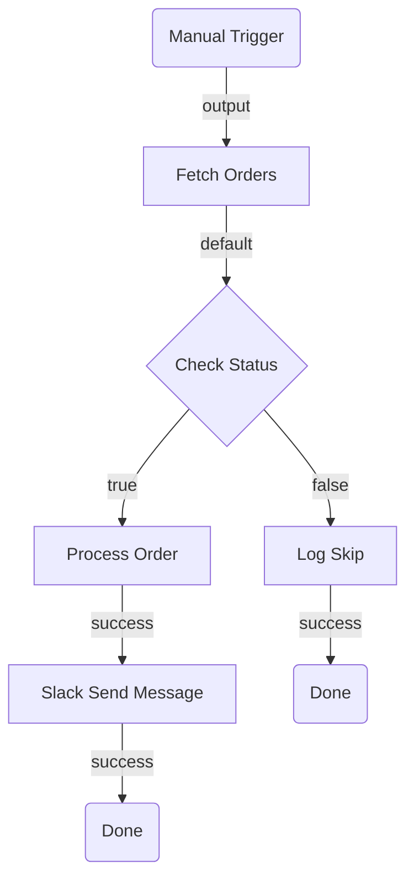

# Planning Phase 1: Architectural Design

Design the flow topology — select node types, define edges, and identify expected inputs and outputs. This phase produces a **mermaid diagram** and structured tables that can be reviewed before any implementation work begins.

> **This phase does NOT run `uip flow registry get`, bind connections, or resolve reference fields.** Those are handled in [Planning Phase 2: Implementation](planning-phase-implementation.md). The goal here is to get the shape of the flow right.

---

## Process

1. Analyze the user's requirements
2. Select node types from the catalog below
3. Define edges (how nodes connect)
4. Identify suspected inputs and outputs for each node
5. Generate a mermaid diagram
6. Validate the mermaid syntax (see [Mermaid Validation Rules](#mermaid-validation-rules))
7. Present the plan for user review
8. Iterate until approved, then hand off to [Planning Phase 2: Implementation](planning-phase-implementation.md)

---

## Node Type Catalog

Each entry shows the node category, when to select it, and what implementation options exist. Use the **Possible Implementations** column to annotate your plan — it tells Phase 2 what to look up.

### Triggers

| Node Type                | When to Select                                  | Possible Implementations                                       |
| ------------------------ | ----------------------------------------------- | -------------------------------------------------------------- |
| `core.trigger.manual`    | Flow is started on demand by a user or API call | Single implementation — no variants                            |
| `core.trigger.scheduled` | Flow runs on a recurring schedule               | Presets: `R/PT1H`, `R/P1D`, `R/P1W`, custom ISO 8601 intervals |

**Rules:**

- Every flow must have exactly one trigger node
- The trigger is always the first node in the topology

### Actions

| Node Type                           | When to Select                                                                        | Possible Implementations                                                     |
| ----------------------------------- | ------------------------------------------------------------------------------------- | ---------------------------------------------------------------------------- |
| `core.action.script`                | Custom logic, data transformation, computation, formatting — no external calls needed | JavaScript (ES2020 via Jint). Must `return { key: value }`                   |
| `core.action.http`                  | Call a REST API where no connector exists, or for quick prototyping                   | GET, POST, PUT, PATCH, DELETE. Supports response branching, retries, IS auth |
| `core.action.transform`             | Declarative map, filter, or group-by on a collection — no custom code needed          | Sub-variants: `.map`, `.filter`, `.group-by`                                 |
| `core.logic.delay`                  | Pause execution for a duration or until a specific date                               | Duration presets (`PT5M` to `P1W`) or date-based (`timeDate`)                |
| `core.action.queue.create`          | Distribute work to robots — fire-and-forget                                           | Queue name + item data payload                                               |
| `core.action.queue.create-and-wait` | Distribute work to robots — wait for result                                           | Queue name + item data payload, blocks until processed                       |

### Control Flow

| Node Type              | When to Select                                                    | Possible Implementations                                                  |
| ---------------------- | ----------------------------------------------------------------- | ------------------------------------------------------------------------- |
| `core.logic.decision`  | Binary branching (if/else) based on a boolean condition           | JavaScript boolean expression via `=js:`                                  |
| `core.logic.switch`    | Multi-way branching (3+ paths) based on ordered case expressions  | Array of `{ id, label, expression }` cases + optional default             |
| `core.logic.loop`      | Iterate over a collection of items                                | Sequential or parallel (`parallel: true`). Exposes `iterator.currentItem` |
| `core.logic.merge`     | Synchronize parallel branches before continuing                   | Waits for all incoming paths to complete                                  |
| `core.control.end`     | Graceful flow completion (one per terminal path)                  | Must map all `out` variables if workflow has outputs                      |
| `core.logic.terminate` | Abort entire flow immediately on fatal error                      | No output mapping — kills all branches                                    |
| `core.subflow`         | Group related steps into a reusable container with isolated scope | Own nodes, edges, variables. Nesting up to 3 levels                       |

### Connector Nodes

Connector nodes call external services via Integration Service. They are **not** built-in — they come from the registry after `uip login` + `uip flow registry pull`.

| When to Select                                                                      | Possible Implementations                                                                                                  |
| ----------------------------------------------------------------------------------- | ------------------------------------------------------------------------------------------------------------------------- |
| A pre-built connector exists for the target service (Jira, Slack, Salesforce, etc.) | Node type pattern: `uipath.connector.<connector-key>.<activity>`. Phase 2 resolves the exact type, connection, and fields |
| A connector exists but lacks the specific endpoint                                  | HTTP Request within the connector (connector handles auth, you supply path/payload)                                       |

**In this phase:** Note the connector as `connector: <service-name>` with the intended operation (e.g., "connector: Jira — create issue"). Phase 2 will run `registry search`, bind connections, and resolve fields.

### Agent Nodes

| Node Type                     | When to Select                                                      | Possible Implementations                          |
| ----------------------------- | ------------------------------------------------------------------- | ------------------------------------------------- |
| `uipath.agent.autonomous`     | Task requires reasoning, judgment, or unstructured input processing | Autonomous agent — reasons and acts independently |
| `uipath.agent.conversational` | Task requires interactive dialogue with a user or system            | Conversational agent — multi-turn interaction     |

**Decision rule — Agent vs Script/Decision:**

| Use an Agent node when...                                               | Use Script/Decision/Switch when...                        |
| ----------------------------------------------------------------------- | --------------------------------------------------------- |
| Input is ambiguous or unstructured (free text, emails)                  | Input is structured and well-defined (JSON, form data)    |
| Task requires reasoning or judgment (triage, classification)            | Task is deterministic (if X then Y, map/filter/transform) |
| Branching depends on context that can't be reduced to simple conditions | Branching conditions are explicit and enumerable          |
| You need natural language generation (draft emails, summaries)          | You need data transformation or computation               |

### Resource Nodes (External Automations)

Resource nodes invoke published UiPath automations. They appear in the registry after login.

| Category        | Node Type Pattern                   | When to Select                                               |
| --------------- | ----------------------------------- | ------------------------------------------------------------ |
| RPA Process     | `uipath.core.rpa-workflow.{key}`    | Need desktop/browser automation via a published RPA workflow |
| Agent           | `uipath.core.agent.{key}`           | Need to invoke a published AI agent                          |
| Agentic Process | `uipath.core.agentic-process.{key}` | Need to invoke a published orchestration process             |
| Flow            | `uipath.core.flow.{key}`            | Need to call another flow as a subprocess                    |
| API Workflow    | `uipath.core.api-workflow.{key}`    | Need to call a published API function                        |
| Human Task      | `uipath.core.human-task.{key}`      | Need to pause for human input via a UiPath App               |

**In this phase:** If the resource exists, note it as `resource: <name> (<category>)`. If it does not exist yet, use `core.logic.mock` as a placeholder and note what needs to be created. Phase 2 will resolve the exact node type from the registry.

### Placeholders

| Node Type         | When to Select                                                                               |
| ----------------- | -------------------------------------------------------------------------------------------- |
| `core.logic.mock` | Step is TBD, resource doesn't exist yet, or prototyping. Placeholder with `input` → `output` |

---

## Selecting External Service Nodes

When the flow needs to call an external service, use this decision order — prefer higher tiers:

1. **Pre-built Integration Service connector** — Use when a connector exists and covers the use case. Note as `connector: <service>`.
2. **HTTP Request within a connector** — Use when a connector exists but lacks the specific endpoint. Note as `connector: <service> (HTTP fallback)`.
3. **Standalone HTTP Request** (`core.action.http`) — Use for one-off API calls to services without connectors. Note the URL pattern and method.
4. **RPA workflow node** — Use only when the target system has no API (legacy desktop apps, terminals). Note as `resource: <name> (rpa)`.

---

## Standard Port Reference

Use this when defining edges. Every edge requires a `sourcePort` and `targetPort`.

| Node Type                           | Input Port(s)       | Output Port(s)                                |
| ----------------------------------- | ------------------- | --------------------------------------------- |
| `core.trigger.manual`               | —                   | `output`                                      |
| `core.trigger.scheduled`            | —                   | `output`                                      |
| `core.action.script`                | `input`             | `success`                                     |
| `core.action.http`                  | `input`             | `default`, `branch-{id}` (dynamic per branch) |
| `core.action.transform`             | `input`             | `output`                                      |
| `core.logic.delay`                  | `input`             | `output`                                      |
| `core.logic.decision`               | `input`             | `true`, `false`                               |
| `core.logic.switch`                 | `input`             | `case-{id}` (dynamic per case), `default`     |
| `core.logic.loop`                   | `input`, `loopBack` | `success`, `output`                           |
| `core.logic.merge`                  | `input` (multiple)  | `output`                                      |
| `core.control.end`                  | `input`             | —                                             |
| `core.logic.terminate`              | `input`             | —                                             |
| `core.subflow`                      | `input`             | `output`, `error`                             |
| `core.logic.mock`                   | `input`             | `output`                                      |
| `core.action.queue.create`          | `input`             | `success`                                     |
| `core.action.queue.create-and-wait` | `input`             | `success`                                     |

---

## Wiring Rules

Apply these when defining edges in the topology:

1. Edges connect a **source port** (output) on one node to a **target port** (input) on another
2. Trigger nodes have no input port — they are always edge sources, never targets
3. End/Terminate nodes have no output port — they are always edge targets, never sources
4. Every non-trigger node must have at least one incoming edge
5. Every non-terminal node must have at least one outgoing edge
6. Decision nodes produce exactly two outgoing edges: one from `true`, one from `false`
7. Switch nodes produce one outgoing edge per case + optionally one from `default`
8. Loop nodes: the `loopBack` port receives the edge returning from the last node inside the loop body; `success` fires after all iterations
9. Merge nodes accept multiple incoming edges (one per parallel path being synchronized)
10. Do not create cycles except through Loop's `loopBack` mechanism
11. **No dangling nodes** — every node must be connected by at least one edge. A node with no incoming and no outgoing edges is invalid. Verify every node in the node table appears in the edge table as either a source or target.

---

## Common Topology Patterns

Use these as building blocks when designing your flow.

### Linear Pipeline

```
Trigger → Action A → Action B → Action C → End
```

### Conditional Branch

```
Trigger → Fetch Data → Decision
  ├── true → Process → End
  └── false → Log Skip → End
```

### Parallel Execution with Merge

```
Trigger → Prepare
  ├── Call API A ──┐
  └── Call API B ──┤
                   └── Merge → Combine → End
```

### Loop Over Collection

```
Trigger → Fetch List → Loop
  └── [loop body] Process Item → (loopBack)
  └── success → Summarize → End
```

### Error Handling

```
Trigger → HTTP Request → Decision (error?)
  ├── true → Log Error → Terminate
  └── false → Process → End
```

### Orchestration (Mixed Resources)

```
Trigger → Script (prepare) → RPA Process (extract) → Agent (classify) → Decision
  ├── approved → Script (format) → End
  └── rejected → Human Task (review) → End
```

### Scheduled Batch Processing

```
Scheduled Trigger → HTTP (fetch batch) → Loop
  └── Queue Create (per item) → (loopBack)
  └── success → Script (summary) → End
```

---

## Output Format

Generate a `<SolutionName>.arch.plan.md` file in the **solution directory** (the folder containing the `.uipx` file, not the project subfolder). The plan covers the entire solution — which may contain multiple projects in the future.

### 1. Summary

2-3 sentences describing what the flow does end-to-end.

### 2. Flow Diagram (Mermaid)

A mermaid flowchart showing all nodes, edges, and branching logic.

**Requirements:**

- Use `graph TD` (top-down) for most flows; `graph LR` (left-right) only for very linear flows with few branches. Do NOT use `flowchart` — it is not supported by all mermaid renderers.
- Use `subgraph` blocks to group related sections — required for flows with 10+ nodes
- Label every edge with the port name (e.g., `-->|success|`, `-->|true|`, `-->|false|`)
- **Labels must be plain text only** — no special characters inside shape delimiters. The following break mermaid parsing:
  - `>` and `<` (interpreted as shape operators or HTML) — replace with words like "over" or "under"
  - `(`, `)`, `[`, `]`, `{`, `}` (conflict with shape delimiters)
  - `:`, `;`, `?`, `&`, `"` (unreliable across renderers)
  - Use plain alphanumeric text and spaces only
- Do NOT put node types in diagram labels — node types belong in the Node Table only
- Do NOT use quotes inside shape delimiters — use `[Text]` not `["Text"]`
- Use only these universally supported node shapes:
  - Triggers: rounded rectangle `(Trigger Name)`
  - Actions: rectangle `[Action Name]`
  - Control flow: diamond `{Decision Name}` for Decision/Switch
  - End/Terminate: rounded rectangle `(Done)`
  - Connectors: rectangle `[Connector Service Operation]`
  - Placeholders: rectangle `[Mock Description]`

**Example:**

````markdown

````

### 3. Node Table

| #   | Node ID     | Name           | Category | Node Type             | Inputs                                                        | Outputs                                         | Notes                         |
| --- | ----------- | -------------- | -------- | --------------------- | ------------------------------------------------------------- | ----------------------------------------------- | ----------------------------- |
| 1   | trigger     | Manual Trigger | trigger  | `core.trigger.manual` | —                                                             | Trigger event                                   | —                             |
| 2   | fetchOrders | Fetch Orders   | action   | `core.action.http`    | `method: GET`, `url: <ORDERS_API_URL>`                        | `output.body` (order list), `output.statusCode` | Phase 2: confirm URL and auth |
| 3   | checkStatus | Check Status   | control  | `core.logic.decision` | `expression: =js:$vars.fetchOrders.output.statusCode === 200` | Routes to `true` or `false`                     | —                             |

**Column definitions:**

- **Node ID**: Short camelCase identifier used in the mermaid diagram and edge table
- **Inputs**: Best-guess input values based on user requirements. Use `<PLACEHOLDER>` for values Phase 2 must resolve (URLs, IDs, connection details)
- **Outputs**: What downstream nodes are expected to consume via `$vars.{nodeId}.*`
- **Notes**: Implementation concerns for Phase 2 (e.g., "Phase 2: resolve Jira project ID", "Phase 2: bind Slack connection")

### 4. Edge Table

| #   | Source Node | Source Port | Target Node  | Target Port | Condition/Label   |
| --- | ----------- | ----------- | ------------ | ----------- | ----------------- |
| 1   | trigger     | output      | fetchOrders  | input       | —                 |
| 2   | fetchOrders | default     | checkStatus  | input       | —                 |
| 3   | checkStatus | true        | processOrder | input       | Status is 200     |
| 4   | checkStatus | false       | logSkip      | input       | Status is not 200 |

**Rules:**

- Source/target ports must match the [Standard Port Reference](#standard-port-reference)
- Every node (except the trigger) must appear as a target at least once
- Every node (except End/Terminate) must appear as a source at least once

### 5. Inputs & Outputs

| Direction | Name           | Type     | Description                                |
| --------- | -------------- | -------- | ------------------------------------------ |
| `in`      | ordersApiUrl   | `string` | Base URL for the orders API                |
| `out`     | processedCount | `number` | Number of orders successfully processed    |
| `inout`   | errorLog       | `array`  | Accumulates error messages across the flow |

### 6. Connector Summary (omit if no connectors)

| Node ID      | Service | Intended Operation      | Phase 2 Action                                                         |
| ------------ | ------- | ----------------------- | ---------------------------------------------------------------------- |
| notifySlack  | Slack   | Send message to channel | Resolve connector key, bind connection, resolve channel ID             |
| createTicket | Jira    | Create issue            | Resolve connector key, bind connection, resolve project/issue type IDs |

### 7. Open Questions (omit if none)

Prefix each with `**[REQUIRED]**` or `**[OPTIONAL]**`:

- **[REQUIRED]** Which Slack channel should notifications go to?
- **[OPTIONAL]** Should the error handler retry before terminating?

---

## Mermaid Validation Rules

LLM-generated mermaid frequently contains syntax errors. After generating the diagram, **check every rule below** before presenting it to the user. Fix violations before outputting.

### Syntax Rules

1. **First line must be `graph TD` or `graph LR`** — use `graph` not `flowchart` (the `flowchart` keyword is not supported by all renderers). `TD` = top-down, `LR` = left-right.
2. **Node IDs must be alphanumeric + underscores only** — no hyphens, dots, or spaces in IDs. Use `fetchData` not `fetch-data` or `fetch.data`
3. **Node IDs must not start with or equal a reserved word** — mermaid reserves these as keywords: `end`, `subgraph`, `graph`, `flowchart`, `direction`, `click`, `style`, `classDef`, `class`, `linkStyle`, `callback`, `default`. IDs that start with these (e.g., `endWarm`, `defaultPath`, `styleNode`) break the parser. Use alternatives like `warmEnd`, `pathDefault`, `nodeStyle` — or use a prefix like `done_warm`, `finish_warm`.
4. **Node labels must be plain text** — no quotes inside shape delimiters. Use `A[Fetch Data]` not `A["Fetch Data"]`.
5. **No special characters in labels** — these break mermaid parsing even when quoted:
   - `>` and `<` (interpreted as shape operators or HTML) — replace with words like "over" or "under"
   - `(`, `)`, `[`, `]`, `{`, `}` (conflict with shape delimiters)
   - `:`, `;`, `?`, `&`, `"` (unreliable across renderers)
   - Use plain alphanumeric text and spaces only
6. **Use only universally supported shapes** — `(text)` for rounded rectangle, `[text]` for rectangle, `{text}` for diamond. Do NOT use `([text])` (stadium), `{{text}}` (hexagon), or other extended shapes — they are not supported by all renderers.
7. **Edge labels use `|label|` between arrow and target** — `A -->|success| B` not `A -->success B` or `A --success--> B`
8. **No empty labels** — `A --> B` is fine, but `A -->|| B` is invalid
9. **Subgraph IDs must be unique** and not collide with node IDs
10. **Subgraph blocks must be closed** — every `subgraph` needs a matching `end`
11. **No semicolons** — mermaid uses newlines, not semicolons, to separate statements
12. **No blank lines inside the mermaid block** — blank lines between node definitions and edges can prevent rendering in some mermaid implementations. Keep all lines contiguous.

### Structural Rules

1. **Every node defined must be connected** — no orphan nodes floating in the diagram
2. **Edge directions must match the flow** — trigger at the top, End at the bottom (for TB layouts)
3. **Decision nodes must show both branches** — `true` and `false` edges, each labeled
4. **Switch nodes must show all case edges** — one per case plus optional default
5. **Loop structures**: show the loop body and the loopBack edge returning to the loop node
6. **Parallel branches** must visually fork from one node and converge at a Merge node

### Validation Procedure

After generating the mermaid block:

1. First line is `graph TD` or `graph LR` — not `flowchart`
2. Check each node ID contains only `[a-zA-Z0-9_]`
3. Check no node ID starts with or equals a reserved word (`end`, `subgraph`, `graph`, `flowchart`, `direction`, `click`, `style`, `classDef`, `class`, `linkStyle`, `callback`, `default`)
4. Check no labels contain `>`, `<`, `:`, `;`, `?`, `&`, `(`, `)`, or quotes — replace with plain words
5. Only `(text)`, `[text]`, and `{text}` shapes are used — no `([text])`, `{{text}}`, or other extended shapes
6. Check each edge has valid `-->`, `-->|label|` syntax
7. Check all subgraphs are closed
8. Verify every node in the node table appears in the diagram
9. Verify every edge in the edge table appears in the diagram
10. Check for blank lines inside the mermaid block — remove any empty lines between statements
11. If any rule is violated, fix it before outputting

---

## Node Selection Heuristics

Use these to pick the right node type when the choice isn't obvious.

### "I need to call an external service"

1. Is there a connector? → `connector: <service>` (Phase 2 resolves)
2. No connector, but has a REST API? → `core.action.http`
3. No API at all (desktop app, terminal)? → `resource: <name> (rpa)` or `core.logic.mock` if unpublished

### "I need to branch"

- Two paths → `core.logic.decision`
- Three or more paths → `core.logic.switch`
- Branch on HTTP response status → use `core.action.http` built-in branches (dynamic ports)

### "I need to transform data"

- Standard map/filter/group-by → `core.action.transform`
- Custom logic, string manipulation, computation → `core.action.script`

### "I need to end the flow"

- Normal completion → `core.control.end` (one per terminal path)
- Fatal error, abort everything → `core.logic.terminate`

### "I need to wait"

- Fixed duration → `core.logic.delay` with duration preset
- Wait until a specific time → `core.logic.delay` with `timeDate`
- Wait for external work to complete → `core.action.queue.create-and-wait`

### "I need human involvement"

- Human approval or data entry → `resource: <app-name> (human-task)` or `core.logic.mock` if the app doesn't exist

### "The flow needs something outside flow capabilities"

1. Add a `core.logic.mock` placeholder
2. Note what needs to be created and which skill handles it:
   - Desktop/browser automation → `uipath-rpa-workflows`
   - Coded workflow (C#) → `uipath-coded-workflows`
   - Agent → `uipath-coded-agents`
3. Phase 2 will check whether the resource has been published and replace the mock

---

## Handoff to Phase 2

When the architectural plan is approved, Phase 2 ([Planning Phase 2: Implementation](planning-phase-implementation.md)) takes over to:

1. Run `uip flow registry search` and `registry get` for all connector and resource nodes
2. Bind Integration Service connections (`uip is connections list`, `ping`)
3. Resolve reference fields via `uip is resources execute list`
4. Validate required fields against user-provided values
5. Replace `<PLACEHOLDER>` values in the node table with resolved IDs
6. Replace `core.logic.mock` nodes with real resource nodes (if now published)
7. Finalize the plan with implementation-ready details

**Do not proceed to Phase 2 until the user explicitly approves the architectural plan.**
