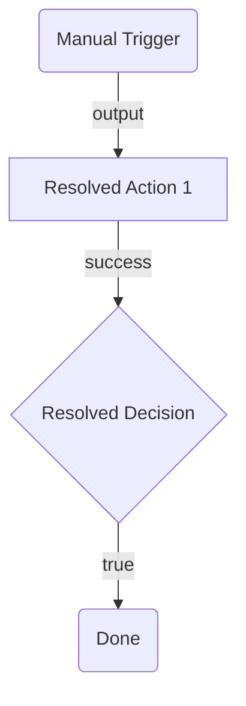

# Planning Phase 2: Implementation Resolution

Resolve all implementation details for the approved architectural plan. This phase takes the `.arch.plan.md` and produces an `.impl.plan.md` with concrete, build-ready values. The node catalog, wiring rules, and flow patterns below are also used during the build step.

> **Prerequisite:** The user must have explicitly approved the architectural plan (`.arch.plan.md`) before starting this phase.
>
> **Always validate with the registry,** even for OOTB nodes. This phase ensures that every node type (built-in or connector-based) is confirmed against the current registry state. Port names, input requirements, and output schemas can change — do not assume OOTB nodes match the planning guides without verification.

---

## Implementation Resolution Process

### Step 1 — Identify Nodes and Validate with Registry

Scan the approved `.arch.plan.md` node table and connector summary. Validate each node type against the registry to confirm ports, inputs, and outputs are current:

| Category | How to identify | Action |
| --- | --- | --- |
| Connector nodes | Node type starts with `uipath.connector.*` or Notes say "connector:" | Run Steps 2a–2d (bind connection, resolve reference fields, validate required inputs) |
| Resource nodes | Node type starts with `uipath.core.*` or Notes say "resource:" | Run Step 3 (registry search, confirm node type) |
| Mock placeholders | Node type is `core.logic.mock` | Run Step 4 (check if published, replace if available) |
| OOTB nodes | Everything else (Script, HTTP, Decision, Loop, etc.) | Run Step 1a below (validate with registry) |

**All nodes, including OOTB, must be validated via registry in Step 1a before proceeding.**

#### Step 1a — Validate All OOTB Node Types with Registry

Even built-in nodes can change. Confirm each OOTB node type against the registry:

```bash
uip flow registry pull --force
uip flow registry get <nodeType> --output json
```

For each OOTB node type in your plan, record:
- Input port names (must match `targetPort` in edges)
- Output port names (must match `sourcePort` in edges)
- Required input fields (`required: true` in `inputDefinition`)
- Output variable schema (`outputDefinition`)

Example: If your plan shows `core.action.script`, run `uip flow registry get core.action.script --output json` and confirm the expected port names (`input`, `success`) and that `script` input is required.

Update your node table if any ports or required fields differ from the planning guide.

### Step 2 — Resolve Connector Nodes

For each connector node, follow the Configuration Workflow in the relevant node guide (`nodes/`):

1. Find the connector node type via `uip flow registry search`
2. Bind a connection (list, pick default enabled, ping to verify)
3. Get enriched metadata with `--connection-id`
4. Resolve reference fields (get IDs, not display names)
5. Validate all required fields have values — ask the user if any are missing

Record the connection ID and resolved field values for the build step.

### Step 3 — Resolve Resource Nodes

For each resource node (RPA process, agent, flow, API workflow, human task):

```bash
uip flow registry pull --force
uip flow registry search "<resource-name>" --output json
```

1. If found: record the exact node type (e.g., `uipath.core.rpa-workflow.invoice-abc123`)
2. If not found: keep the `core.logic.mock` placeholder and note the gap

```bash
uip flow registry get "<node-type>" --output json
```

Record `inputDefinition` and `outputDefinition` for the node table.

### Step 4 — Replace Mock Nodes

For each `core.logic.mock` node in the architectural plan:

1. Check if the resource has been published since planning: `uip flow registry search "<name>" --output json`
2. If published: replace the mock with the real resource node type, update inputs/outputs
3. If not published: keep the mock and include it in the "Mock Placeholders" section of the output

### Step 5 — Replace Placeholders

Update the node table from the `.arch.plan.md`:

- Replace `<PLACEHOLDER>` values with resolved IDs
- Replace `connector: <service>` annotations with actual node types
- Replace `resource: <name>` annotations with actual node types
- Update inputs with resolved reference field values
- Update outputs based on `outputDefinition` from registry

### Step 6 — Write the Implementation Plan

Generate a `<SolutionName>.impl.plan.md` file in the **solution directory** (same location as the `.arch.plan.md`).

#### Output Format

```markdown
# <SolutionName> Implementation Plan

## Resolved Node Table

| # | Node ID | Name | Node Type | Inputs | Outputs | Connection ID | Notes |
| --- | --- | --- | --- | --- | --- | --- | --- |

## Flow Diagram (Mermaid)

Copy the mermaid diagram from `.arch.plan.md`, then update node labels if any node types changed due to mock replacement or connector resolution. Use the same diagram from architectural planning — it remains the visual reference for the flow structure.



## Resolved Edge Table

(Copy from `.arch.plan.md` — update only if node IDs changed due to mock replacement)

## Bindings

| Connector Key | Connection ID | Activity | Verified |
| --- | --- | --- | --- |

## Variables

(Copy from `.arch.plan.md` Inputs and Outputs section)

## Mock Placeholders (if any)

| Node ID | Intended Resource | Skill to Use | Status |
| --- | --- | --- | --- |

## Changes from Architectural Plan

- List what changed between `.arch.plan.md` and this plan
- Record any node type changes (connector resolutions, mock replacements)
- Note any port or input field changes discovered during registry validation
```

#### Column Additions

The implementation plan adds these columns beyond the architectural plan:

- **Connection ID**: The bound IS connection UUID (connector nodes only)
- **Verified**: Whether the connection was pinged successfully

### Step 7 — Get Approval

Present a short summary in chat:

1. Registry validation results — confirm all OOTB node ports and inputs match the plan
2. How many connector/resource nodes were resolved
3. Any port or input field changes discovered during validation
4. Any mock placeholders remaining
5. Any required fields that need user input
6. Any connections that need to be created

Tell the user to review `<SolutionName>.impl.plan.md`, including the updated mermaid diagram and registry confirmations. Do NOT proceed to the build step until the user explicitly approves.

---

## Product Heuristics

These are org-wide "when to use what" rules that can't be encoded in individual node descriptions. They reflect how UiPath's products fit together and which approach to prefer for a given task.

### Connecting to External Services

See [planning-phase-architectural.md — Selecting External Service Nodes](planning-phase-architectural.md) for the 4-tier decision order (IS connector → HTTP within connector → standalone HTTP → RPA).

### Agent Nodes vs Workflow Logic

| Use an Agent node when... | Use Script/Decision/Switch when... |
|---|---|
| Input is ambiguous or unstructured (free text, emails, support tickets) | Input is structured and well-defined (JSON, form data) |
| The task requires reasoning or judgment (triage, classification, summarization) | The task is deterministic (if X then Y, map/filter/transform) |
| Branching depends on context that can't be reduced to simple conditions | Branching conditions are explicit and enumerable |
| You need natural language generation (draft emails, summaries) | You need data transformation or computation |

**Anti-pattern:** Don't use an agent node for tasks that can be done with a Decision + Script. Agents are slower, more expensive (LLM tokens), and less predictable. Use them where their flexibility is actually needed.

**Hybrid pattern:** Use workflow nodes for the deterministic parts (fetch data, transform, route) and agent nodes for the ambiguous parts (classify intent, draft response, extract entities). The flow orchestrates; the agent reasons.

---

## Node Catalog

### Triggers

| Node Type | Description | Output Ports |
|-----------|-------------|--------------|
| `core.trigger.manual` | Entry point for manual workflow execution. Every flow needs at least one trigger. | `output` |
| `core.trigger.scheduled` | Entry point with recurring schedule (ISO 8601 repeating intervals). | `output` |

**Manual trigger:** No inputs needed. Must set `model.entryPointId` to a UUID matching `entry-points.json`.

**Scheduled trigger:** Requires `timerType: "timeCycle"` and `timerPreset` (e.g., `R/PT1H` for hourly, `R/P1D` for daily). Use `timerPreset: "custom"` with `timerValue` for non-standard intervals. See [node-reference.md — Scheduled Trigger](node-reference.md) for presets and examples.

**Constraint:** Must connect to at least one downstream node (`minConnections: 1`).

### Actions

#### Script (`core.action.script`)

Execute custom JavaScript code. Use for data transformation, computation, formatting, or any logic that doesn't need an external call.

| | |
|--|--|
| **Input port** | `input` |
| **Output ports** | `success` |
| **Required inputs** | `script` (string, non-empty) |
| **Output variables** | `output` (the return value), `error` (error object if failed) |

**Script rules:**
- JavaScript only (not TypeScript, not Python) — executed via [Jint](https://github.com/sebastienros/jint) (ES2020). No browser/DOM APIs (`fetch`, `document`, `window`, `setTimeout` are unavailable). Pure ES only.
- Must `return` an object: `return { key: value }` (not a bare scalar)
- `$vars` is available as a global — use it directly: `return { upper: $vars.input1.toUpperCase() }`
- Cannot make HTTP calls or access external systems (use HTTP node for that)
- 30-second execution timeout

#### HTTP Request (`core.action.http`)

Make REST API calls. Supports branching on response status, retries, and authentication via Integration Service connections.

| | |
|--|--|
| **Input port** | `input` |
| **Output ports** | Dynamic branch ports (`branch-{id}`) + `default` |
| **Required inputs** | `method`, `url` |
| **Output variables** | `output` (`{ body, statusCode, headers }`), `error` |

**Key inputs:**
- `method` — GET, POST, PUT, PATCH, DELETE (default: GET)
- `url` — Must be a valid URL or expression
- `headers` — Object of key-value pairs
- `body` — Request body string (JSON, XML, etc.)
- `contentType` — default `application/json`
- `timeout` — ISO 8601 duration (default: `PT15M`)
- `retryCount` — Number of retries on failure (default: 0)
- `branches` — Array of `{ id, name, conditionExpression }` for response routing
- `authenticationType` — `manual` or from a connector connection
- `application`, `connection` — For IS-authenticated requests

**Dynamic ports:** Each entry in `branches` creates a `branch-{item.id}` output port. If no branch condition matches, flow goes to `default`.

#### Transform (`core.action.transform`)

Map, filter, or group-by data in a collection. Sub-variants: `core.action.transform.map`, `core.action.transform.filter`, `core.action.transform.group-by`.

| | |
|--|--|
| **Input port** | `input` |
| **Output ports** | `output` |
| **Required inputs** | `collection` (non-empty), `operations` (non-empty array) |

#### Delay (`core.logic.delay`)

Pause execution for a duration or until a specific date. Uses ISO 8601 time formats.

| | |
|--|--|
| **Input port** | `input` |
| **Output ports** | `output` |
| **Required inputs** | `timerType` (`timeDuration` or `timeDate`), `timerPreset` |

**Duration presets:** `PT5M`, `PT15M`, `PT30M`, `PT1H`, `PT6H`, `PT12H`, `P1D`, `P1W`, or `custom` with `timerValue`.

**Date-based:** Set `timerType: "timeDate"` and `timerDate` to an ISO 8601 datetime or `=js:` expression.

See [node-reference.md — Delay](node-reference.md) for full JSON examples.

#### Queue Nodes

| Node Type | Description |
|---|---|
| `core.action.queue.create` | Create a queue item in Orchestrator and continue immediately |
| `core.action.queue.create-and-wait` | Create a queue item and wait for processing to complete |

Both accept: `queue` (name), `itemData` (JSON payload), `priority`, `reference`, `deferDate`, `dueDate`.

See [orchestration-guide.md — Queue Integration](orchestration-guide.md) for details and examples.

### Control Flow

#### Decision (`core.logic.decision`)

If/else branching. Evaluates a boolean JavaScript expression and routes to `true` or `false` branch.

| | |
|--|--|
| **Input port** | `input` |
| **Output ports** | `true`, `false` |
| **Required inputs** | `expression` (boolean JS expression) |

**Expression examples:**
- `$vars.fetchData.output.status === "approved"`
- `$vars.rollDice.output.roll > 3`
- `$vars.httpCall.output.statusCode === 200 && $vars.httpCall.output.body.count > 0`

Optional: `trueLabel` and `falseLabel` to customize branch display names.

#### Switch (`core.logic.switch`)

Multi-way branching. Evaluates cases in order, takes the first `true` one. Optional default fallback.

| | |
|--|--|
| **Input port** | `input` |
| **Output ports** | Dynamic `case-{id}` ports + optional `default` |
| **Required inputs** | `cases` (array, min 1 item, each with `{ id, label, expression }`) |

**When to use Switch vs Decision:** Use Decision for simple true/false. Use Switch for 3+ branches (e.g., route by status code, priority level, category).

#### Loop (`core.logic.loop`)

Iterate over a collection. Supports sequential and parallel execution. Has aggregated output after all iterations complete.

| | |
|--|--|
| **Input ports** | `input`, `loopBack` (internal loop return) |
| **Output ports** | `success` (after completion), `output` (aggregated results) |
| **Required inputs** | `collection` (expression pointing to array) |

**Internal variables (available inside loop body only):**
- `iterator.currentItem` — The item being processed in this iteration
- `iterator.currentIndex` — 0-based iteration index
- `iterator.collection` — The full collection

**External output:** `output` — Aggregated results from all iterations.

Optional: `parallel: true` to execute all iterations concurrently.

#### Merge (`core.logic.merge`)

Synchronization point that waits for all incoming parallel paths to complete before continuing.

| | |
|--|--|
| **Input port** | `input` (accepts multiple connections) |
| **Output port** | `output` |

**When to use:** After parallel branches (e.g., two API calls that can run simultaneously). Connect both branches to Merge, then continue from Merge's output.

#### End (`core.control.end`)

Graceful workflow completion. Use as the terminal node for each execution path.

| | |
|--|--|
| **Input port** | `input` |
| **Output ports** | None |

**Output mapping:** If the workflow declares output variables, every End node must map all of them via `node.outputs[varId].source`.

#### Terminate (`core.logic.terminate`)

Immediately stop entire workflow execution (like throwing an exception). Use for fatal errors or abort conditions.

| | |
|--|--|
| **Input port** | `input` |
| **Output ports** | None |

**End vs Terminate:** End = graceful completion of one path. Terminate = abort everything immediately. Use End for normal flow completion. Use Terminate for error paths where continuing other branches would be harmful.

#### Subflow (`core.subflow`)

Group steps into a reusable, drillable container with isolated variable scope.

| | |
|--|--|
| **Input port** | `input` |
| **Output ports** | `output`, `error` |
| **Inputs** | Mapped from subflow's `in` variables |
| **Outputs** | Mapped from subflow's `out` variables |

**Key properties:** Subflows have their own `nodes`, `edges`, and `variables` stored in `subflows.{nodeId}`. Parent `$vars` are not visible inside — pass values via inputs. Subflows can be nested up to 3 levels.

See [node-reference.md — Subflow](node-reference.md) for the full JSON structure.

### Placeholders

| Node Type | Description |
|-----------|-------------|
| `core.logic.mock` | Placeholder node (input → output). Use during planning to represent "TBD" steps or for prototyping. |

### Connector Nodes

Connector nodes call external services via Integration Service. See the relevant node guide in `nodes/` for the full configuration guide including connection binding, `inputs.detail` structure, and debugging.

**To find connector nodes:**
```bash
uip flow registry search <service> --output json
```

Before using a connector node, run Steps 2a–2d above to bind a connection and resolve reference fields.

### Agent Nodes

Built-in agent nodes for AI-powered reasoning within flows:

| Node Type | Description |
|---|---|
| `uipath.agent.autonomous` | Autonomous agent — reasons and acts independently |
| `uipath.agent.conversational` | Conversational agent — interactive dialogue |

Available after login: `uip flow registry search "uipath.agent" --output json`

See [orchestration-guide.md — Built-in Agent Nodes](orchestration-guide.md) for when to use agent vs script nodes.

### Resource Nodes (External Automations)

Resource nodes invoke published UiPath automations from within a flow. They appear in the registry after login.

| Category | Node Type Pattern | Description |
|---|---|---|
| RPA Process | `uipath.core.rpa-workflow.{key}` | Run a published RPA workflow |
| Agent | `uipath.core.agent.{key}` | Run a published AI agent |
| Agentic Process | `uipath.core.agentic-process.{key}` | Run an orchestration process |
| Flow | `uipath.core.flow.{key}` | Run another flow as a subprocess |
| API Workflow | `uipath.core.api-workflow.{key}` | Call a published API function |
| Human Task | `uipath.core.human-task.{key}` | Pause for human input via a UiPath App |

**Discovery:** `uip flow registry search "<resource-name>" --output json`

**If the resource doesn't exist yet:** Use a `core.logic.mock` placeholder and tell the user which skill to use to create it. See [orchestration-guide.md](orchestration-guide.md) for the full "create new" workflow.

---

## Expressions and Variables

For the **complete reference** on variables (declaration, types, scoping, variable updates) and expressions (`=js:`, templates, Jint constraints), see [variables-and-expressions.md](variables-and-expressions.md).

### Quick Reference

Nodes communicate data through `$vars`. Every node's output is accessible downstream via `$vars.{nodeId}.{outputProperty}`.

```javascript
$vars.rollDice.output.roll              // Script return value
$vars.fetchData.output.body             // HTTP response body
$vars.fetchData.output.statusCode       // HTTP status code
$vars.someNode.error.message            // Error information
iterator.currentItem                     // Loop item (inside loop body)
```

**Expression prefixes:**
- `=js:` — Full JavaScript expression evaluated by Jint: `=js:$vars.count > 10`
- `{ }` — Template interpolation for string fields: `Order {$vars.orderId} is {$vars.status}`

**Variable directions** (`variables.globals`):
- `in` — External input (read-only after start)
- `out` — Workflow output (must be mapped on End nodes)
- `inout` — State variable (updated via `variableUpdates`)

---

## Node Selection Guide

### "I need to run custom logic"
Use **Script** (`core.action.script`). Write JavaScript, return an object. Common pattern: HTTP (fetch) → Script (transform) → HTTP (send) or Decision (branch).

### "I need to call an external API"
- **First choice:** Check if a **connector node** exists for the service (`uip flow registry search <service> --output json`). Connectors handle auth, pagination, and error formatting automatically.
- **Second choice:** Use **HTTP Request** (`core.action.http`) for generic REST APIs or services without a dedicated connector.

### "I need to branch based on a condition"
- **Two paths:** Use **Decision** (`core.logic.decision`)
- **Three or more paths:** Use **Switch** (`core.logic.switch`)
- **Branch on HTTP response:** Use HTTP Request's built-in `branches` config (creates dynamic output ports per condition)

### "I need to transform data"
- **Standard map/filter/group-by on collections:** Use **Transform** (`core.action.transform`) — declarative, no code needed.
- **Custom logic:** Use **Script** (`core.action.script`).

### "I need to iterate over a collection"
Use **Loop** (`core.logic.loop`). Supports both sequential and parallel execution, with aggregated output after all iterations complete.

### "I need to run things in parallel"
Wire multiple outputs from one node to different downstream nodes. Use **Merge** (`core.logic.merge`) to synchronize before continuing.

### "I need to end the flow"
- **Normal completion:** Use **End** (`core.control.end`)
- **Abort on error:** Use **Terminate** (`core.logic.terminate`)
- A flow can have multiple End nodes (one per terminal path)

### "I need to wait before continuing"
Use **Delay** (`core.logic.delay`). Supports fixed durations (`PT15M`, `P1D`) or wait-until-date (`timeDate` with ISO 8601 datetime). See [node-reference.md — Delay](node-reference.md).

### "I need to distribute work to robots"
Use **Queue** nodes. `core.action.queue.create` for fire-and-forget; `core.action.queue.create-and-wait` when you need the processed result. See [orchestration-guide.md — Queue Integration](orchestration-guide.md).

### "I need to group related steps"
Use **Subflow** (`core.subflow`). Groups nodes into a reusable container with isolated scope. Supports nesting up to 3 levels. See [node-reference.md — Subflow](node-reference.md).

### "I need to invoke an RPA process, agent, or other automation"
Use a **Resource node**. Check the registry first (`uip flow registry search`). If the resource exists, add it directly. If not, use a `core.logic.mock` placeholder and tell the user which skill to create it with. See [orchestration-guide.md](orchestration-guide.md).

### "I need human approval or input"
Use a **Human Task** node (`uipath.core.human-task.{key}`). This pauses the flow and presents a UiPath App to a user. See [orchestration-guide.md — Human Task](orchestration-guide.md).

### "I need to run the flow on a schedule"
Replace the manual trigger with **Scheduled Trigger** (`core.trigger.scheduled`). See [node-reference.md — Scheduled Trigger](node-reference.md).

### "I need error handling"
Nodes expose error information via `$vars.nodeId.error` (with `code`, `message`, `detail` fields). Use a Decision node after an action to check for errors and branch to a handler or Terminate.

### "The flow needs something I can't build with flow nodes"
When a flow requires capabilities outside the flow skill's scope — an RPA process for desktop automation, a coded workflow for complex logic, a custom agent — **stop and point, don't chain skills.**

1. Add a `core.logic.mock` placeholder node in the plan where the external component goes
2. Tell the user what's needed and which skill to use:
   - Desktop/browser automation → `/uipath:uipath-rpa-workflows`
   - Coded workflow (C#) → `/uipath:uipath-coded-workflows`
   - Agent → `/uipath:uipath-coded-agents`
3. Once the user creates the component, replace the placeholder with the real node

**Do not** attempt to invoke other skills automatically. Each skill should work independently — cross-skill chaining multiplies failure rates.

---

## Wiring Rules

### Port Compatibility

- Edges connect a **source** port (output) on one node to a **target** port (input) on another
- Source handles have `type: "source"`, target handles have `type: "target"`
- You cannot wire two source ports together or two target ports together

### Connection Constraints

Some nodes enforce connection rules via `constraints` in their handle configuration:

| Constraint | Meaning |
|-----------|---------|
| `minConnections: N` | Handle must have at least N edges (validation error if not met) |
| `maxConnections: N` | Handle accepts at most N edges |
| `forbiddenSourceCategories: ["trigger"]` | Cannot receive connections from trigger nodes |
| `forbiddenTargetCategories: ["trigger"]` | Cannot connect output to trigger nodes |

**Key rules:**
- Trigger nodes can only have outgoing connections (no input port)
- End/Terminate nodes can only have incoming connections (no output port)
- Control flow outputs generally cannot loop back to triggers
- Decision and Switch nodes cannot receive connections from agent resource nodes

### Dynamic Ports

Some nodes create ports based on their configuration:
- **HTTP Request** — One port per `branches` entry: `branch-{id}`
- **Switch** — One port per `cases` entry: `case-{id}`
- **Loop** — `success` port fires after completion, `output` port carries aggregated results

When wiring to dynamic ports, the port ID must match the configured item's `id`.

---

## Common Flow Patterns

### Linear Pipeline

```text
Trigger → Action A → Action B → Action C → End
```
Simple sequential processing. Each node's output port (`success` for Script, `default` for HTTP, `output` for Transform) connects to the next node's `input`.

### Conditional Branch

```text
Trigger → Fetch Data → Decision ──true──→ Process → End
                          │
                          └──false──→ Log Skip → End
```
Branch on a condition. Each path needs its own End node (or both can merge to one).

### Parallel Processing with Merge

```text
                    ┌→ Call API A ─┐
Trigger → Split ────┤              ├→ Merge → Combine Results → End
                    └→ Call API B ─┘
```
Wire one node's output to multiple downstream nodes. Use Merge to wait for all before continuing.

### Error Handling

```text
Trigger → HTTP Request ──default──→ Decision($vars.httpCall.error) ──true──→ Log Error → Terminate
                                        │
                                        └──false──→ Process → End
```
Check `$vars.nodeId.error` after action nodes. Use a Decision to branch on error presence, then route to a handler or Terminate.

### Orchestration (Mixed Resource Types)

```text
Trigger → Script (prepare) → RPA Process (extract) → Agent (classify) → Decision →
  approved: Script (format) → End
  rejected: Human Task (review) → End
```
Flow composes different automation types into one business process. Each resource node's output feeds the next via `$vars`.

### Subflow Composition

```text
Trigger → Subflow (validate) → Decision (valid?) →
  true: Subflow (process) → End
  false: Script (log) → Terminate
```
Use subflows to encapsulate reusable logic. Each subflow has isolated scope — pass data via inputs/outputs.

### Scheduled Batch Processing

```text
Scheduled Trigger (R/PT1H) → HTTP (fetch batch) → Loop (items) →
  Queue Create (per item) → End Loop → Script (summary) → End
```
Combine scheduled triggers with loops and queues for recurring batch jobs.
