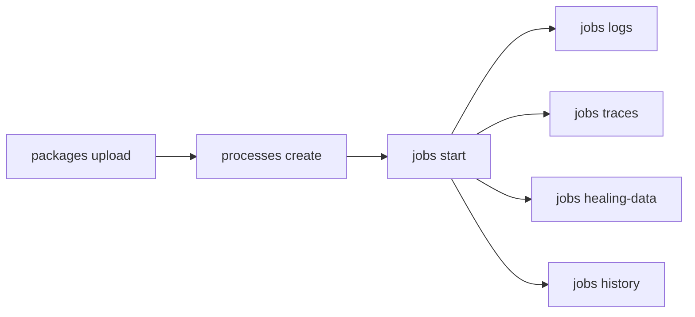

# Run Jobs

Upload automation packages, bind them as processes, start jobs, and monitor execution with logs, traces, and healing data.

> For full option details on any command, use `--help` (e.g., `uip or jobs start --help`)

## When to Use

- Deploying and running automations end-to-end
- Debugging failed or faulted jobs
- CI/CD pipeline execution and verification
- Monitoring long-running unattended processes

## Prerequisites

- Authenticated (`uip login`)
- Target folder exists with machines assigned (see [setup-environment.md](setup-environment.md))
- Automation package (.nupkg) built and ready to upload

## Flow



---

## Step 1: Upload Package

```bash
uip or packages upload ./MyProcess.1.0.0.nupkg --output json

# Target a custom feed instead of the tenant default
uip or packages upload ./MyProcess.1.0.0.nupkg --feed-id <feed-key> --output json
```

## Step 2: Inspect Package

Verify the upload and discover entry points before creating a process.

```bash
# Search for the uploaded package
uip or packages list --search "MyProcess" --output json

# List all versions of a package
uip or packages versions <package-id> --output json

# Inspect entry points (key format: PackageId:Version)
uip or packages entry-points "MyProcess:1.0.0" --output json
```

Entry points show which workflows inside the package can be executed. Multi-entry-point packages require `--entry-point` when creating a process.

## Step 3: Create Process

Bind the uploaded package to a folder as a runnable process:

```bash
uip or processes create --name "MyProcess" \
  --package-key "MyProcess" \
  --package-version "1.0.0" \
  --folder-path "Production" \
  --output json
```

Key options:

| Option | Description |
|--------|-------------|
| `--runtime-type` | `Unattended`, `Attended`, `Development`, `NonProduction` |
| `--entry-point` | Required for multi-entry-point packages |
| `--auto-update` | Automatically use latest package version |
| `--job-priority` | `Low`, `Normal`, `High` |
| `--input-arguments` | Default input arguments (JSON) |
| `--tags` | Comma-separated tags for filtering |

## Step 4: Start Job

Start execution from a process. The process key comes from `uip or processes list`.

```bash
uip or jobs start <process-key> --folder-path "Production" --output json

# With input arguments and wait
uip or jobs start <process-key> --folder-path "Production" \
  --input-arguments '{"invoiceId": "INV-001", "amount": 1500}' \
  --wait-for-completion --timeout 600 \
  --output json
```

Key options: `--input-arguments` (JSON), `--input-file` (path), `--attachment`, `--runtime-type`, `--wait-for-completion`, `--timeout` (default 300s), `--poll-interval` (default 5s), `--run-as-me`.

## Step 5: Monitor Job

Check job status. `jobs get` is cross-folder -- no `--folder-path` needed:

```bash
# Get a specific job by key
uip or jobs get <job-key> --output json

# List running jobs in a folder
uip or jobs list --state Running --folder-path "Production" --output json

# Filter by process name and date range
uip or jobs list --process-name "MyProcess" --folder-path "Production" --output json
```

## Step 6: Get Logs

```bash
uip or jobs logs <job-key> --output json                  # All logs
uip or jobs logs <job-key> --level Error --output json    # Error logs only
uip or jobs logs <job-key> --export -o ./logs.csv         # Export to CSV file
```

`--export` writes a CSV file instead of terminal output. Combine with `-o` to set the output path. Logs are cross-folder -- no `--folder-path` required.

## Step 7: Get Traces

Retrieve LLM and agentic execution traces for Agent-type processes:

```bash
uip or jobs traces <job-key> --output json
```

Traces are only available for processes that use UiPath Autopilot or Agent capabilities. For deeper span-level data, use `uip traces spans get` (see [traces.md](../traces.md)).

Traces are cross-folder -- no `--folder-path` required.

## Step 8: Get Healing Data

Download Autopilot recovery data (screenshots + UI element data) as a ZIP:

```bash
uip or jobs healing-data <job-key> -o ./healing-data.zip
```

The ZIP contains screenshots and UI metadata from Autopilot self-healing attempts.

## Step 9: Job History

View the state transition timeline (e.g., Pending -> Running -> Faulted) with timestamps:

```bash
uip or jobs history <job-key> --output json
```

## Step 10: Stop, Restart, Resume

Control running or suspended jobs:

```bash
# Stop a running job
uip or jobs stop <job-key> --strategy SoftStop --output json

# Force-kill a job
uip or jobs stop <job-key> --strategy Kill --output json

# Restart a faulted or stopped job
uip or jobs restart <job-key> --output json

# Resume a suspended job with new input
uip or jobs resume <job-key> --input-arguments '{"approved": true}' --output json
```

## Step 11: Manage Processes

Update, rollback, or edit processes after deployment:

```bash
# Update to a newer package version
uip or processes update-version <process-key> --output json

# Rollback to previous version
uip or processes rollback <process-key> --output json

# Edit process properties
uip or processes edit <process-key> --output json
```

---

## Complete Example

```bash
# Upload -> create process -> start job -> check logs
uip or packages upload ./InvoiceProcessor.1.0.0.nupkg --output json
uip or packages entry-points "InvoiceProcessor:1.0.0" --output json

uip or processes create --name "InvoiceProcessor" \
  --package-key "InvoiceProcessor" --package-version "1.0.0" \
  --folder-path "Finance" --runtime-type Unattended --job-priority Normal \
  --output json

uip or jobs start <process-key> --folder-path "Finance" \
  --input-arguments '{"batchDate": "2026-04-22"}' \
  --wait-for-completion --timeout 600 --output json

uip or jobs logs <job-key> --level Error --output json
uip or jobs logs <job-key> --export -o ./invoice-logs.csv
```

---

## Variations and Gotchas

### "Process" vs "Release"

The CLI uses "process" but the Orchestrator API calls this entity a "Release". They are the same thing. When reading API docs, `ReleaseKey` = process key from `uip or processes list`.

### Process Key vs Package Key

These are different identifiers:

| Key | Source | Format |
|-----|--------|--------|
| Process key | `uip or processes list` | GUID (e.g., `a1b2c3d4-...`) |
| Package key | `uip or packages list` | String ID (e.g., `InvoiceProcessor`) |
| Package download key | `uip or packages download` | `PackageId:Version` (e.g., `InvoiceProcessor:1.0.0`) |

### Job States

Jobs progress through these states:

```
Pending -> Running -> Successful
                   -> Faulted
                   -> Stopped
                   -> Suspended (awaiting input)
```

Final states (Successful, Faulted, Stopped) are frozen -- no further transitions occur.

### Wait and Input Behavior

- `--wait-for-completion` polls at `--poll-interval` (default 5s) until a final state or `--timeout` (default 300s)
- `--input-arguments` accepts JSON; `--input-file` reads from a file path
- If JSON exceeds 10K characters, the CLI automatically offloads it to an InputFile (server-side)
- Use `uip or packages entry-points` to discover expected argument names and types

### Cross-Folder Commands

These commands resolve the folder from the job key -- no `--folder-path` needed:

- `uip or jobs get <key>`
- `uip or jobs logs <key>`
- `uip or jobs traces <key>`
- `uip or jobs history <key>`
- `uip or jobs healing-data <key>`

### Package Download

To download a package .nupkg, use the `PackageId:Version` format:

```bash
uip or packages download "MyProcess:1.0.0" --destination ./packages/ --output json
```

---

## Related

- [setup-environment.md](setup-environment.md) -- Folder creation, machine assignment, user setup
- [traces.md](../traces.md) -- Deep-dive into LLM/agentic traces and spans
- [Resources](../resources/resources.md) -- Assets, queues, triggers, buckets
