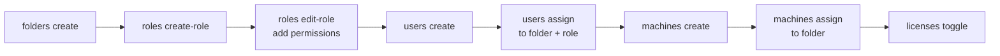

# Setup Environment

Create folders, assign users with roles, provision machines, and configure licenses.

---

## When to Use

- Setting up a new tenant for a team or project.
- Onboarding users into an existing Orchestrator environment.
- Provisioning machine templates and license slots for CI/CD pipelines.
- Scripting repeatable environment creation across dev/staging/prod.

## Prerequisites

1. Authenticated: `uip login`
2. Tenant selected: `uip login tenant set <tenant-name>`
3. Sufficient permissions: tenant-level admin or folder-create rights.

---

## Flow



Each step depends on output from the previous one -- folder keys feed into user assignments, user keys feed into role bindings, and machine keys feed into license toggles.

---

## Steps

### Step 1: Create Folders

Folders are the primary organizational unit. Create them first because every subsequent resource assignment targets a folder.

```bash
uip or folders create "Finance" --output json
```

Key options:
- `--parent <key-or-path>` -- Nest inside an existing folder (GUID key or path like `"Shared"`).
- `--description <text>` -- Human-readable description.
- `--permission-model <model>` -- `FineGrained` (default, per-folder RBAC) or `InheritFromTenant`.

Save the `Key` from the response -- you will use it as `--folder-path` or `--folder-key` in later steps.

```bash
# Nested folder
uip or folders create "Invoicing" --parent "Finance" -d "Invoice processing" --output json
```

### Step 2: Explore Folders

Verify the folder structure before proceeding.

```bash
# Folders the current user can access
uip or folders list --output json

# All folders in the tenant (requires admin permissions)
uip or folders list --all --output json

# Filter: only standard top-level folders
uip or folders list --all --type standard --top-level --output json

# Get details for a specific folder
uip or folders get "Finance" --output json
uip or folders get <folder-key-guid> --output json

# Check runtime capacity in a folder
uip or folders runtimes "Finance" --output json
```

The `--all` flag enables filtering options (`--type`, `--name`, `--path`, `--top-level`, `--order-by`). Without `--all`, only folders the current user is assigned to are returned.

### Step 3: Create Roles

Roles group permissions and are scoped to either the tenant or a folder. Create the role first (it starts with zero permissions), then add permissions to it.

```bash
# Create a folder-scoped role
uip or roles create-role --name "FinanceOperator" --type Folder --output json

# Add permissions to the role
uip or roles edit-role <role-key> \
  --add-permissions "Assets.View,Assets.Edit,Queues.View,Jobs.Create,Jobs.View" \
  --output json
```

Use `uip or roles list-permissions` to discover all grantable permission names. Use `uip or roles get-role <key>` to inspect a role's current grants.

Role types:
- **Tenant** -- Applies across the entire tenant. Assigned via `uip or users assign-roles`.
- **Folder** -- Applies only within specific folders. Assigned via `uip or users assign` or `uip or roles assign`.

### Step 4: Create Users

Create users at the tenant level. They exist tenant-wide but have no folder access until explicitly assigned.

```bash
uip or users create --username "jane.doe@example.com" --output json
```

Key options:
- `--role-keys <keys>` -- Comma-separated role GUIDs for tenant-level role assignment at creation time.
- `--allow-unattended` -- Enable unattended job execution capability.
- `--unattended-username <user>` / `--unattended-password <pass>` -- Windows credentials for unattended execution.
- `--name <first>` / `--surname <last>` / `--email <email>` -- Profile fields.

Save the `Key` from the response for the next step.

### Step 5: Assign Users to Folders

Assign the user to a folder, optionally with folder-level roles. This is what grants them access to the folder's resources.

```bash
uip or users assign \
  --user-key <user-key-guid> \
  --folder-path "Finance" \
  --role-keys <role-key-guid> \
  --output json
```

Key details:
- `--role-keys` is optional. Users can be assigned to a folder without roles (the API's `RoleId` is nullable). They will have access to the folder but no specific permissions until roles are added.
- Use `--folder-path` (e.g., `"Finance"` or `"Finance/Invoicing"`) or `--folder-key` (GUID).
- To verify: `uip or users list-in-folder --folder-path "Finance" --output json`.

### Step 6: Create Machines

Machines define execution hosts and their license slot allocations. They are tenant-scoped and must be assigned to folders separately.

```bash
uip or machines create --name "finance-runner-01" --output json
```

Key options:
- `--serverless` -- Create a serverless (cloud-hosted) machine instead of a standard template.
- `--unattended-slots <n>` -- Number of unattended runtime slots.
- `--headless-slots <n>` -- Number of headless runtime slots.
- `--non-production-slots <n>` -- Non-production slots for testing.
- `-d, --description <text>` -- Machine description.

### Step 7: Assign Machines to Folders

Machines must be assigned to a folder before jobs in that folder can use them. The assign command accepts one or more machine keys.

```bash
uip or machines assign <machine-key-guid> --folder-path "Finance" --output json

# Assign multiple machines at once
uip or machines assign <key1> <key2> <key3> --folder-path "Finance" --output json
```

Verify: `uip or machines list --folder-path "Finance" --output json`.

### Step 8: Configure Licenses

Toggle machine licensing on or off for specific runtime types. Check tenant capacity first.

```bash
# Check overall license capacity
uip or licenses info --output json

# Enable unattended licensing for the machine
uip or licenses toggle <machine-key-guid> --type Unattended --enable --output json

# List current license assignments
uip or licenses list --type Unattended --output json
```

Toggle supports runtime types only: `Unattended`, `NonProduction`, `Headless`, `TestAutomation`. Named-user types (`Attended`, `Development`, `Studio`, etc.) are managed differently and cannot be toggled.

---

## Complete Example

End-to-end script setting up a "Finance" folder with a user, role, and machine:

```bash
# 1. Authenticate
uip login --output json
uip login tenant set "Production" --output json

# 2. Create the folder
uip or folders create "Finance" -d "Finance department automations" --output json
# Response: { "Data": { "Key": "a1b2c3d4-...", "Path": "Finance" } }

# 3. Create a folder role and add permissions
uip or roles create-role --name "FinanceOperator" --type Folder --output json
# Response: { "Data": { "Key": "r1r2r3r4-..." } }

uip or roles edit-role r1r2r3r4-... \
  --add-permissions "Assets.View,Assets.Edit,Queues.View,Jobs.Create,Jobs.View,Processes.View" \
  --output json

# 4. Create a user
uip or users create --username "jane.doe@example.com" \
  --name "Jane" --surname "Doe" --email "jane.doe@example.com" \
  --allow-unattended --output json
# Response: { "Data": { "Key": "u1u2u3u4-..." } }

# 5. Assign user to folder with role
uip or users assign \
  --user-key u1u2u3u4-... \
  --folder-path "Finance" \
  --role-keys r1r2r3r4-... \
  --output json

# 6. Create a machine
uip or machines create --name "finance-runner-01" \
  --unattended-slots 2 -d "Finance department runner" --output json
# Response: { "Data": { "Key": "m1m2m3m4-..." } }

# 7. Assign machine to folder
uip or machines assign m1m2m3m4-... --folder-path "Finance" --output json

# 8. Enable licensing
uip or licenses toggle m1m2m3m4-... --type Unattended --enable --output json

# 9. Verify the setup
uip or folders runtimes "Finance" --output json
uip or users list-in-folder --folder-path "Finance" --output json
uip or machines list --folder-path "Finance" --output json
```

---

## Variations and Gotchas

### Folder edit uses `edit`, not `update`

The verb is `edit` for both folders and machines: `uip or folders edit <key>`, not `update`.

### Users can be assigned without roles

The `--role-keys` flag on `uip or users assign` is optional. A user can be assigned to a folder with no roles -- they appear in the folder's user list but have no permissions until roles are added later.

### Machine scopes

Machines have a `scope` field that determines their nature:

| Scope | Description |
|-------|-------------|
| `Default` | Standard on-premises machine template. |
| `Shared` | Shared across folders. |
| `Serverless` | Cloud-hosted, created with `--serverless`. |
| `Cloud` | UiPath cloud machine. |
| `AutomationCloudRobot` | Automation Cloud Robot. |
| `ElasticRobot` | Elastic (auto-scaling) cloud machine. |
| `PersonalWorkspace` | Bound to a personal workspace. |

### Role resolver pages all roles client-side

The role-resolver utility fetches all roles to map GUIDs to numeric IDs. For tenants with many custom roles, this adds a brief delay on the first role-related command in a session.

### `--all` flag on folders list enables filtering

Filtering options (`--type`, `--name`, `--path`, `--top-level`, `--order-by`) only work with `--all`. Without `--all`, the command returns only folders the current user is assigned to and rejects filter flags.

### Personal workspaces are flat

`uip or folders list --all --type personal` returns personal workspaces with a different shape (`Key`, `Name`, `OwnerName`, `OwnerKey`, `LastLogin`). The `--path` and `--top-level` flags are not supported because personal workspaces have no hierarchy.

---

## Related

- [Run Jobs](run-jobs.md) -- After setup, deploy packages and start jobs in the folder.
- [Resources](../resources/resources.md) -- Create assets, queues, and buckets in the folder.
