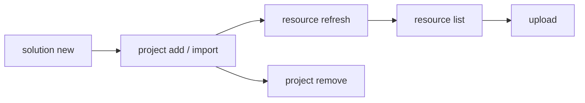

# Develop a Solution

Create a solution, add automation projects, and sync resource declarations.

> For full option details on any command, use `--help` (e.g., `uip solution project add --help`).

## When to Use

- Starting a new multi-project automation from scratch
- Organizing existing projects into a single deployable unit
- Managing resource declarations across projects before packing

## Prerequisites

- Authenticated (`uip login`) -- required for remote resource lookup during `resource refresh` and for `upload`
- Projects to add must contain `project.uiproj` or `project.json`

## Flow



---

## Step 1: Create a New Solution

```bash
uip solution new "InvoiceAutomation" --output json
```

Creates `InvoiceAutomation/InvoiceAutomation.uipx`. All projects must live inside this directory (or be imported into it).

## Step 2: Add Existing Projects

Register a project that already lives inside the solution directory.

```bash
uip solution project add ./InvoiceAutomation/Processor --output json

# With explicit solution file
uip solution project add ./InvoiceAutomation/Reporter ./InvoiceAutomation/InvoiceAutomation.uipx --output json
```

The `.uipx` is auto-discovered by walking up from the project path if not specified.

## Step 3: Import External Projects

Copy a project from outside the solution tree into the solution directory and register it.

```bash
uip solution project import --source /path/to/ExternalProject --output json
```

Unlike `add`, `import` copies source files into the solution directory first, then registers the copy.

## Step 4: Remove a Project

Unregister a project from the `.uipx` manifest. Does NOT delete files from disk.

```bash
uip solution project remove ./InvoiceAutomation/OldProject --output json
```

## Step 5: List Resources

Show resources declared in the solution, available in Orchestrator, or both.

```bash
uip solution resource list ./InvoiceAutomation --output json
uip solution resource list ./InvoiceAutomation --source local --output json
uip solution resource list ./InvoiceAutomation --kind Queue --search "Invoice" --output json
```

| Option | Values | Default |
|--------|--------|---------|
| `--kind <kind>` | `Queue`, `Asset`, `Bucket`, `Process`, `Connection` | All kinds |
| `--search <term>` | Name substring match | No filter |
| `--source <source>` | `all`, `local`, `remote` | `all` |

## Step 6: Refresh Resources

Re-scan all projects and sync resource declarations from their `bindings_v2.json` files.

```bash
uip solution resource refresh ./InvoiceAutomation --output json
```

| Field | Meaning |
|-------|---------|
| `Created` | New resources added to the solution manifest |
| `Imported` | Resources matched and imported from Orchestrator |
| `Skipped` | Resources already tracked in the solution |
| `Warnings` | Any issues encountered during sync |

Run after adding/importing projects or editing any project's `bindings_v2.json`.

## Step 7: Upload to Studio Web

Upload the solution for browser-based editing. Accepts a directory, `.uipx` file, or `.uis` archive.

```bash
uip solution upload ./InvoiceAutomation --output json
```

If the `SolutionId` in `.uipx` matches an existing Studio Web solution, the upload overwrites it.

## Step 8: Delete from Studio Web

Remove a solution from Studio Web by its UUID (returned by `upload`).

```bash
uip solution delete <solution-id> --output json
```

Deletes the Studio Web copy only -- local files and published packages are not affected.

---

## Complete Example

Create a solution with two projects, sync resources, and verify:

```bash
# 1. Create the solution
uip solution new "InvoiceAutomation" --output json

# 2. Add projects (already inside the solution directory)
uip solution project add ./InvoiceAutomation/Processor --output json
uip solution project add ./InvoiceAutomation/Reporter --output json

# 3. Sync resource declarations from project bindings
uip solution resource refresh ./InvoiceAutomation --output json

# 4. Verify resources are tracked
uip solution resource list ./InvoiceAutomation --source local --output json
```

---

## Variations and Gotchas

### `add` vs `import`

| | `project add` | `project import` |
|-|----------------|-------------------|
| Project location | Must already be inside the solution directory | Can be anywhere on disk |
| File handling | Registers only (no file copy) | Copies into solution tree, then registers |
| Use case | Project created inside the solution | Bringing in an external project |

### `remove` does not delete files

`project remove` unregisters from `.uipx` but leaves the project directory intact. Delete files manually if needed.

### `resource refresh` is the sync mechanism

Adding a project does not automatically sync its resources. The refresh scans all registered projects for `bindings_v2.json`, creates solution resources for untracked bindings, imports from Orchestrator when a match exists, and skips already-tracked bindings.

### Virtualizable vs non-virtualizable resources

| Virtualizable | Non-virtualizable |
|---------------|-------------------|
| Queue, Asset, Bucket | Process, Connection |
| Can exist as local placeholders (created at deploy time) | Must reference an existing Orchestrator resource |

### `upload` overwrites on matching SolutionId

The `SolutionId` in `.uipx` determines identity. If a Studio Web solution with the same ID exists, `upload` replaces it. To upload as a new solution, change the `SolutionId`.

### `delete` uses the solution UUID, not the name

Get the UUID from `upload` output or Studio Web -- the name string is not accepted.

### `.uipx` auto-discovery

When `[solutionFile]` is omitted, the CLI walks up from the project path looking for a single `.uipx` file. If multiple `.uipx` files exist in the same directory, specify which one explicitly.

---

## Related

- [Pack & Deploy](pack-and-deploy.md) -- Next step: pack, publish, and deploy the solution
- [solution.md](solution.md) -- Solution tool overview and full command tree
