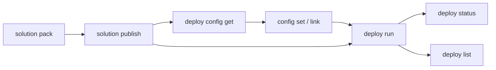

# Pack & Deploy

Pack a solution into a deployable package, publish to the feed, and deploy to Orchestrator with optional configuration.

> For full option details on any command, use `--help` (e.g., `uip solution deploy run --help`).

## When to Use

- Deploying automations to staging or production environments
- CI/CD pipelines that pack, publish, and deploy on every merge
- Multi-environment promotion (dev -> staging -> production)

## Prerequisites

- Authenticated (`uip login`)
- Solution developed and ready to pack (see [develop-solution.md](develop-solution.md))

## Flow



---

## Step 1: Pack the Solution

Build a deployable .zip from a solution directory:

```bash
uip solution pack ./MySolution ./output --output json

# With explicit name and version
uip solution pack ./MySolution ./output --name "MySolution" --version "2.0.0" --output json
```

| Option | Description | Default |
|--------|-------------|---------|
| `<solutionPath>` | Directory containing a `.uipx` or `.uis` file (required) | -- |
| `<outputPath>` | Directory where the .zip will be written (required) | -- |
| `--name <name>` | Override the package name | Name from `.uipx` |
| `--version <version>` | Set the package version | `1.0.0` |

The output is a `.zip` file named `<name>.<version>.zip`.

## Step 2: Publish to the Solution Feed

Upload the packed .zip so it appears in the UiPath solution feed:

```bash
uip solution publish ./output/MySolution.2.0.0.zip --output json

# Target a specific tenant
uip solution publish ./output/MySolution.2.0.0.zip --tenant "Production" --output json
```

After publishing, the package is visible via `uip solution packages list` and available for deployment.

## Step 3 (Alternative): Upload to Studio Web

If the goal is browser-based editing rather than deployment, use `upload` instead of `publish`:

```bash
uip solution upload ./MySolution --output json
```

This uploads to Studio Web for collaborative editing. It does **not** place the package on the solution feed and cannot be used with `deploy run`.

## Step 4: Deploy to Orchestrator

Deploy the published package. This creates a new Orchestrator folder and provisions all solution resources inside it:

```bash
uip solution deploy run -n "InvoiceAutomation-v2" \
  --package-name "MySolution" --package-version "2.0.0" \
  --folder-name "MySolutionFolder" --output json
```

Key options:

| Option | Description | Default |
|--------|-------------|---------|
| `-n, --name <name>` | Deployment name (required) | -- |
| `--package-name <name>` | Published solution package name (required) | -- |
| `--package-version <version>` | Package version to deploy (required) | -- |
| `--folder-name <name>` | New Orchestrator folder to create (required) | -- |
| `--folder-path <path>` | Parent folder under which the new folder is created | -- |
| `--folder-key <key>` | Parent folder key (GUID, alternative to `--folder-path`) | -- |
| `--config-file <path>` | Configuration file from `deploy config get` | -- |
| `--timeout <seconds>` | Polling timeout | 360 |
| `--poll-interval <ms>` | Polling interval | 5000 |
| `-t, --tenant <name>` | Tenant override | Current tenant |

## Step 5: Check Deployment Status

The `deploy run` command returns a pipeline deployment ID. Use it to check progress:

```bash
uip solution deploy status <pipeline-deployment-id> --output json
```

## Step 6: List Deployments

```bash
uip solution deploy list --output json
uip solution deploy list --folder-path "Shared" --take 20 --order-by "Name" --order-direction "asc" --output json
```

Options: `--folder-path`, `--take` (default 10), `--order-by`, `--order-direction` (`asc`/`desc`).

---

## Configuration Workflow

The config workflow lets you customize resource settings and link to existing Orchestrator resources before deploying. This is the key to environment-specific deployments.

### Fetch Default Configuration

```bash
uip solution deploy config get "MySolution" -d config.json --output json

# For a specific version (latest is used if omitted)
uip solution deploy config get "MySolution" -d config.json --package-version "2.0.0" --output json
```

This writes a JSON file containing all configurable resources and their default properties.

### Set a Resource Property

```bash
uip solution deploy config set config.json MyQueue maxNumberOfRetries 5
```

Arguments: `<config-file> <resource-name> <property> <value>`.

### Set a Property for All Resources

```bash
uip solution deploy config set config.json --all conflictFixingAction UseExisting
```

The `--all` flag only works with `conflictFixingAction`. This controls what happens when a resource with the same name already exists in the target folder.

### Link to an Existing Orchestrator Resource

Instead of creating a new resource during deployment, link a solution resource to one that already exists:

```bash
uip solution deploy config link config.json MyQueue \
  --name ProductionQueue --folder-path "Shared/Production"
```

This tells the deployment to use the existing `ProductionQueue` in `Shared/Production` instead of creating a new `MyQueue`.

### Unlink a Resource

Remove a link so the resource is created fresh during deployment:

```bash
uip solution deploy config unlink config.json MyQueue
```

### Deploy with Configuration

Pass the customized config file to `deploy run`:

```bash
uip solution deploy run -n "InvoiceAutomation-Prod" \
  --package-name "MySolution" --package-version "2.0.0" \
  --folder-name "ProdFolder" --folder-path "Production" \
  --config-file config.json --output json
```

---

## CI/CD Example (GitHub Actions)

```yaml
name: Deploy UiPath Solution
on:
  push:
    branches: [main]
jobs:
  deploy:
    runs-on: ubuntu-latest
    steps:
      - uses: actions/checkout@v4
      - run: npm install -g @uipath/cli
      - run: uip login --client-id "${{ secrets.UIPATH_CLIENT_ID }}" --client-secret "${{ secrets.UIPATH_CLIENT_SECRET }}" --tenant "${{ secrets.UIPATH_TENANT }}" --output json
      - run: uip solution pack ./MySolution ./output --version "1.0.${{ github.run_number }}" --output json
      - run: uip solution publish ./output/MySolution.*.zip --output json
      - run: uip solution deploy run -n "MySolution-${{ github.run_number }}" --package-name "MySolution" --package-version "1.0.${{ github.run_number }}" --folder-name "MySolution" --config-file deploy-config.json --output json
```

---

## Environment Promotion

Pack once, then publish and deploy to each environment in sequence:

```bash
uip solution pack ./MySolution ./output --version "1.2.0" --output json

# Staging
uip login tenant set "Staging" --output json
uip solution publish ./output/MySolution.1.2.0.zip --output json
uip solution deploy run -n "MySolution-Staging" --package-name "MySolution" --package-version "1.2.0" \
  --folder-name "MySolution" --config-file staging-config.json --output json

# Production (after validation)
uip login tenant set "Production" --output json
uip solution publish ./output/MySolution.1.2.0.zip --output json
uip solution deploy run -n "MySolution-Prod" --package-name "MySolution" --package-version "1.2.0" \
  --folder-name "MySolution" --config-file production-config.json --output json
```

---

## Version Bumping

Always increment the version when republishing (patch for fixes, minor for features, major for breaking changes). The solution feed rejects duplicate name+version pairs.

---

## Variations and Gotchas

### `publish` vs `upload`

These are different commands with different destinations:

| Command | Destination | Purpose |
|---------|-------------|---------|
| `solution publish` | Solution feed | For deployment via `deploy run` |
| `solution upload` | Studio Web | For browser-based editing |

### `deploy run` Creates a New Folder

`--folder-name` specifies a folder to **create**, not an existing folder to deploy into. If the folder already exists, deployment will fail. Use `--folder-path` to set the parent folder where the new folder is created.

### `--folder-path` is the Parent

On `deploy run`, `--folder-path` is the **parent** folder, not the deployment folder itself. The deployment folder is `--folder-name`, created inside `--folder-path`.

### Config `link` Connects to Existing Resources

`config link` does not copy or move a resource. It tells the deployment to use an existing Orchestrator resource instead of creating a new one. The linked resource must already exist in the specified folder.

### Config `set --all` is Limited

The `--all` flag on `config set` only works with `conflictFixingAction`. It cannot be used to set arbitrary properties across all resources.

### `deploy list --take` and Folder Filtering

Folder filtering with `--folder-path` happens **after** fetching `--take` results. If your deployment is missing from the list, increase `--take` to ensure the server returns enough results before filtering.

### Units Mismatch

`--poll-interval` is in **milliseconds** (default 5000ms = 5s). `--timeout` is in **seconds** (default 360s = 6min). Do not confuse the two.

---

## Related

- [develop-solution.md](develop-solution.md) -- Create and structure a solution from scratch
- [activate-and-manage.md](activate-and-manage.md) -- Activate deployments, uninstall, manage packages
