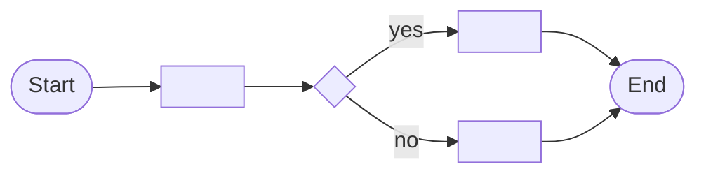

# Solution Design Document — <PROCESS_NAME>

<!-- Use this template when the primary product is Maestro Flow.
     A Flow orchestrates multiple automation types (RPA, agents, apps, API workflows, HITL).
     Phase 2 sections: §3, §4, §5, §7, §9. Phase 3 sections: all others. -->

---

## Document History

| Date | Version | Author | Role | Comments |
|---|---|---|---|---|
| <DATE> | 1.0 | <AUTHOR> | Generated by AI Agent | Initial SDD generated from PDD |

---

## Table of Contents

1. Flow Overview
2. Flow Diagram
3. Nodes Inventory
4. Variables
5. Subflows
6. Triggers
7. Integrated Components
8. Error Handling
9. Project Structure
10. Testing Strategy
11. Implementation Plan

---

## 1. Flow Overview

| Field | Value |
|---|---|
| **Flow name** | <FLOW_NAME> |
| **Objective** | <OBJECTIVE> |
| **Department / Function** | <DEPARTMENT> — <FUNCTION> |
| **Trigger type** | <MANUAL / SCHEDULED / EVENT / HTTP> |
| **Expected execution volume** | <EXECUTIONS_PER_DAY> |

### In Scope

- <ACTIVITY_1>

### Out of Scope

- <ACTIVITY_1>

---

## 2. Flow Diagram

<!-- Build from the Phase 1 extracted steps. One node per logical step.
     Show decision points as diamond shapes, parallel branches with fork/join. -->



---

## 3. Nodes Inventory

<!-- List every node in execution order. Node types include:
     - Trigger (manual, scheduled, event)
     - Logic (if, loop, switch)
     - RPA invocation (calls a Studio process)
     - Agent invocation (calls a UiPath Agent)
     - API Workflow invocation (calls an API Workflow)
     - Connector (Integration Service)
     - Coded App (launches or receives from a coded app)
     - Transform (data map, filter, group-by)
     - HITL (QuickForm or AppTask) — flag for uipath-human-in-the-loop skill
     - Subflow (calls a subflow) -->

| # | Node Key | Node Type | Description | Inputs | Outputs | Notes |
|---|---|---|---|---|---|---|
| 1 | `start` | Trigger | <DESCRIPTION> | — | — | Trigger type: <MANUAL/SCHEDULED/EVENT> |
| 2 | `<NODE_KEY>` | <NODE_TYPE> | <DESCRIPTION> | <INPUTS> | <OUTPUTS> | <NOTES_INCLUDING_HITL_FLAGS> |

---

## 4. Variables

<!-- Flow variables are declared at flow scope with in/inout/out direction. -->

| Name | Direction | Type | Default | Description |
|---|---|---|---|---|
| <VAR_NAME> | <IN / INOUT / OUT> | <TYPE> | <DEFAULT_VALUE> | <DESCRIPTION> |

---

## 5. Subflows

<!-- Only include if the flow uses subflows. Subflows have isolated scope. -->

| Subflow Name | Purpose | Inputs | Outputs | Called From Nodes |
|---|---|---|---|---|
| `<SUBFLOW_NAME>` | <PURPOSE> | <INPUT_VARS> | <OUTPUT_VARS> | <NODE_KEYS> |

---

## 6. Triggers

<!-- How the flow is invoked. -->

| Trigger Type | Configuration | Notes |
|---|---|---|
| <MANUAL/SCHEDULED/EVENT/HTTP> | <CRON_OR_EVENT_SPEC> | <NOTES> |

---

## 7. Integrated Components

<!-- Flag the automation types the flow orchestrates. Each flagged item creates an implementation task. -->

### RPA Processes Invoked

| Process Name | Called From Node | Purpose |
|---|---|---|
| `<PROCESS_NAME>` | `<NODE_KEY>` | <PURPOSE> |

### Agents Invoked

| Agent Name | Called From Node | Purpose |
|---|---|---|
| `<AGENT_NAME>` | `<NODE_KEY>` | <PURPOSE> |

### API Workflows Invoked

| API Workflow Name | Called From Node | Purpose |
|---|---|---|
| `<API_WORKFLOW_NAME>` | `<NODE_KEY>` | <PURPOSE> |

### Integration Service Connectors

| Connector | Called From Node | Operation |
|---|---|---|
| <CONNECTOR_NAME> (Salesforce/Jira/etc.) | `<NODE_KEY>` | <OPERATION> |

### HITL Touchpoints

<!-- Flag HITL nodes. Implementation routes to uipath-human-in-the-loop skill. -->

| Node Key | HITL Type | Purpose | Approval Criteria |
|---|---|---|---|
| `<NODE_KEY>` | <QUICKFORM / APPTASK> | <PURPOSE> | <WHO_APPROVES_AND_WHAT_CRITERIA> |

### Coded Apps Referenced

| App Name | Called From Node | Role |
|---|---|---|
| `<APP_NAME>` | `<NODE_KEY>` | <HITL_FORM / DASHBOARD / ACTION_CENTER_TASK> |

---

## 8. Error Handling

| Scope | Error Type | Trigger | Action |
|---|---|---|---|
| Flow-level | Unhandled exception | Any node fails | <FAIL_FLOW / NOTIFY / RETRY> |
| Node-level | <SPECIFIC_ERROR> | <CONDITION> | <RETRY_POLICY> |

---

## 9. Project Structure

```text
<FLOW_PROJECT_NAME>/
├── project.json
├── flow_files/
│   └── <FLOW_NAME>.flow
├── entry-points.json
├── bindings_v2.json
└── content/
    └── <FLOW_NAME>.bpmn  (auto-generated)
```

### Orchestrator Deployment Target

- [ ] Studio Web (default)
- [ ] Orchestrator (requires `uipath-platform` skill)

---

## 10. Testing Strategy

### Canonical Test Case

| Input Variable | Value |
|---|---|
| <VAR_NAME> | `<TEST_VALUE>` |

### Happy Path Assertions

1. <ASSERTION_1>

### Error Path Scenarios

| Scenario | Setup | Expected Flow Behavior |
|---|---|---|
| <SCENARIO_NAME> | <SETUP> | <EXPECTED> |

---

## 11. Implementation Plan

> **Instructions for the implementing agent:**
> Execute tasks in the order listed below. For each task, read the referenced SDD sections BEFORE starting.
> Use the exact values, mappings, node types, and structure documented in this SDD — do not infer, guess, or deviate.
> Each task description below is a self-contained prompt. Execute it as written.

### Task 1 — Create Flow project
**Dependencies:** none
**References:** §9 Project Structure

> Create a Maestro Flow project named `<FLOW_PROJECT_NAME>` using `uip flow init`.
> Verify the project structure matches §9 before proceeding.

### Task 2 — Define variables and triggers
**Dependencies:** Task 1
**References:** §4 Variables, §6 Triggers

> Configure flow-level variables per §4: <LIST_EACH_VARIABLE_WITH_DIRECTION_AND_TYPE>.
> Set up the trigger per §6: <TRIGGER_TYPE_AND_CONFIG>.

### Task 3 — Create integrated components
**Dependencies:** none
**References:** §7 Integrated Components

> For each RPA process in §7: create the RPA project (this will trigger the RPA skill).
> For each Agent in §7: create the agent project (this will trigger the agents skill).
> For each API Workflow in §7: create the API Workflow (this will trigger the API workflow skill).
> For each Integration Service connector in §7: configure the connector.
> Skip any category that has no entries.

### Task 4 — Build flow nodes
**Dependencies:** Tasks 2, 3
**References:** §3 Nodes Inventory, §5 Subflows

> Build each node listed in §3 Nodes Inventory, in execution order.
> For each node: use the exact node type, inputs, and outputs from §3.
> For subflows listed in §5: create them with isolated scope and the specified inputs/outputs.

### Task 5 — Add HITL nodes
**Dependencies:** Task 4
**References:** §7 HITL Touchpoints

> For each HITL touchpoint in §7: add a HITL node to the flow per the specified type (QuickForm or AppTask).
> This task will route to the human-in-the-loop skill. Skip if no HITL touchpoints are flagged.

### Task 6 — Implement error handling
**Dependencies:** Task 4
**References:** §8 Error Handling

> Wire up error handling per §8. Each row specifies scope, error type, trigger, and action.

### Task 7 — Publish and test
**Dependencies:** Task 6
**References:** §10 Testing Strategy, §9 Deployment Target

> Publish the flow to the deployment target specified in §9.
> Run the canonical test case from §10. Verify all happy path assertions pass.

---

**End of Solution Design Document.**
